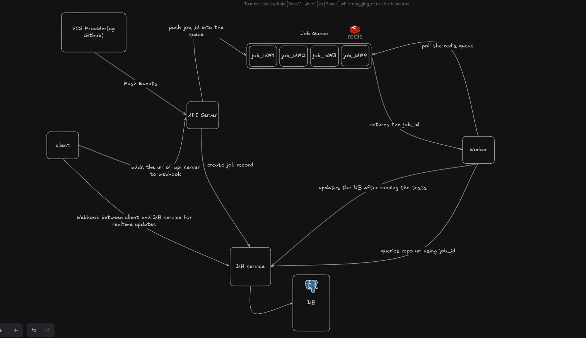

# BraceletCI

### A distributed, event-driven Continuous Integration platform built in Go

BraceletCI is a self-hosted CI system designed with scalability and service isolation in mind. Instead of a monolithic architecture, BraceletCI separates responsibilities into dedicated services that communicate through events and APIs.

## Features

- Event-driven architecture
- Distributed worker execution
- Docker-based isolated builds
- GitHub webhook integration
- Real-time pipeline updates
- Redis-backed job queue
- PostgreSQL persistence
- Service-oriented architecture
- Designed for horizontal scaling

---

## Architecture

  
   
  BraceletCI request, queue, worker, and database flow

 
## Services

### BraceletCI API Service

The `bracelet-ci` service is the main API entry point. It detects repository
pushes through GitHub webhooks, creates a CI job, and queues that job for a
worker.

Responsible for:

- Receiving GitHub push events at `POST /webhook`
- Reading the repository clone URL and pushed commit SHA
- Creating a job through the DB Service
- Queueing the job ID in Redis for a worker

---

### Worker Service

Responsible for:

- Polling Redis
- Cloning repositories
- Building Docker images
- Executing pipelines
- Sending execution events

Workers are completely stateless and can be horizontally scaled.

---

### DB Service

Responsible for:

- Database operations
- Event processing
- Relational queries
- WebSocket updates
- Job metadata
- Project metadata
- User metadata

The DB Service is the single owner of the PostgreSQL database.

## 🔄 Pipeline Flow

1. User registers a GitHub repository.
2. GitHub sends the push event to the BraceletCI API webhook.
3. BraceletCI API creates a job through the DB Service.
4. DB Service stores the job.
5. Job ID is pushed into Redis.
6. A worker picks up the job.
7. Repository is cloned.
8. Docker image is built.
9. Pipeline commands are executed.
10. Worker streams logs and status updates.
11. DB Service updates PostgreSQL.
12. Dashboard receives real-time updates.

---

## ⚡ Event-Driven Design

BraceletCI uses an event-driven write model.

Examples of events include:

- Create User
- Create Project
- Create Job

Writes are processed through events, while relational reads are served synchronously by the DB Service.

## 📄 License

MIT
